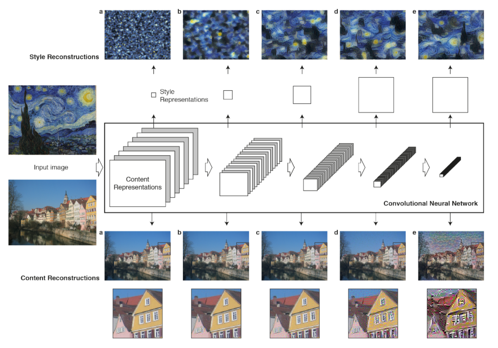

<h1>DeepArtist - Neural images style transferring application playground</h1>

A GUI python application (just a basic Tkinter) implementing of neural algorithm of artistic style transfering images 
base on [Gatys et al.](https://arxiv.org/abs/1508.06576) For those who want a cool art picture, But don't have enough 
skill to do it on your own or someone who wants to prove the idea that "Machine can imagine?"

    

    
    Gatys et al. algorithm it uses a pre-trained model to extract features from both content and style images on 
    specifies layers. then try to create a new image that contains features from both images by minimizing the loss.
    

 
This application will let you play along with the algorithm and it parameters. You can choose which models, layers to 
use as content-loss and style-loss or adjust the weights of each layer or channel. To see how these parameters affect
the transferring.

    

## Prerequisites

** This still under development so there no executable program (for now?).

- Python > 3.6
- Pytorch > 1.7

*** GPU >= GTX-1050

## User Manual

1. Left-click on the content and style canvas to open image selection.
    - Rescale the image with a number to divide to reduce computation time but it will affect the result.
    - Bigger images require more GPU memory!
2. Adjust the parameter (Iteration is how long to run).
3. Click Set then Transfer.
4. Left-click on the outout to save the image.

** Right-click on the content or style canvas will open the feature channels window to adjust the weights for each 
channel. But for now, this window seems a little bit buggy it may cause the program to run slower when using it.